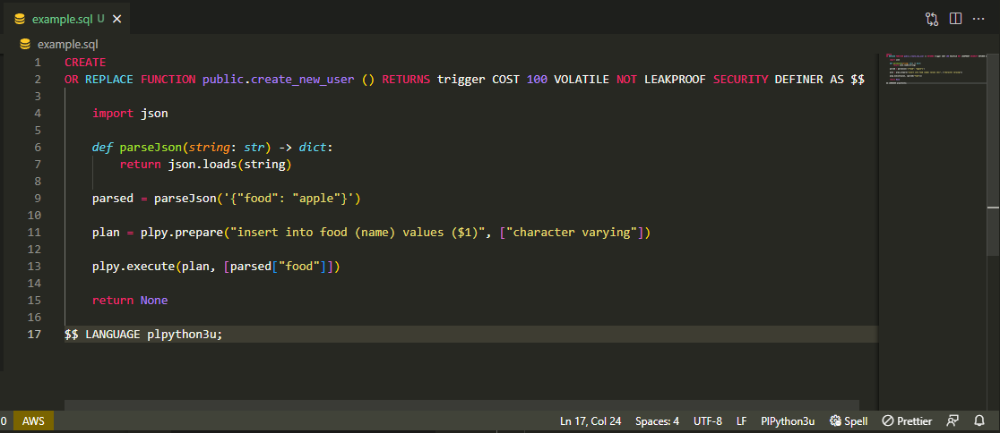

# PlPython README

## Features

Syntax highlighting for python code in SQL Procedure Language



## Usage

- Change language from `SQL` to `plpython3u`. `plpython3u` is an extension of `SQL`. https://github.com/microsoft/vscode/tree/main/extensions/sql
- Python code should be wrapped in between `AS $$` and `$$ LANGUAGE plpython3u` in order t

```sql
AS $$

# Your python code goes here

$$ LANGUAGE plpython3u
```

## Known Issues

- No intellisense
- No formatter
- Commenting shortcut does not work

## Contributing

Feel free to fork the branch and do an PR if you find any bugs or want to improve on the extension. Thank you.

## Releases

### 1.0.0

Initial plpython3u extension
